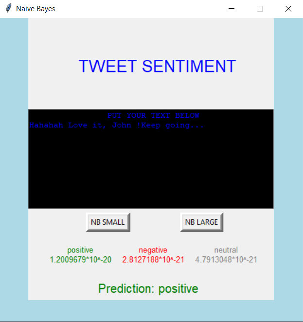
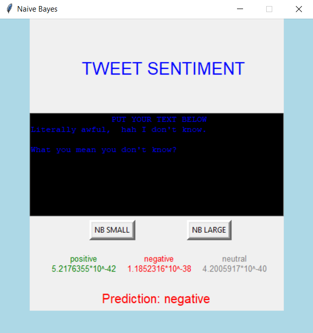

<h1 align="center"> Binary Multinomial Naive Bayes for Text Classification </h1>

 <b>N.B.</b> The idea is to showcase the model implementation and its' usage. The large model was trained with only a sample of the large dataset, which could be provided upon request. Both models are not reliable evaluators because of the small capacity to train. 

Built by exact description as in https://web.stanford.edu/~jurafsky/slp3/.

--- 
<h2>The Model</h2>
As an example of a generative model, this simple classifier returns the class with maximum posterior probability given a document, i.e. which is the most likely class to have generated the document.  
In this case the classes are emotions: positive, negative and neutral. It is calculated by making use of the  **prior probabilities**  and the **document likelihood**, all summed in log-space to avoid underflow. 
When predicting, any words that don't appear in the training set are ignored, one of the simplifying assumptions the `Naive` model makes. 
---
<h2>Usage</h2>

1. Small text/tweet is pasted and model is selected. After click on either of the buttons the prediction is generated. 

<em>Positive tweet predicted:</em> 

<em>Negative tweet predicted:</em> 

--- 