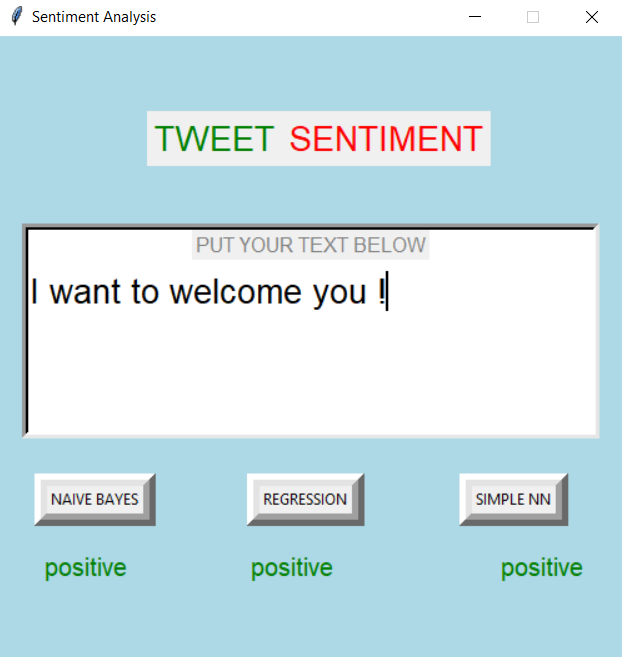
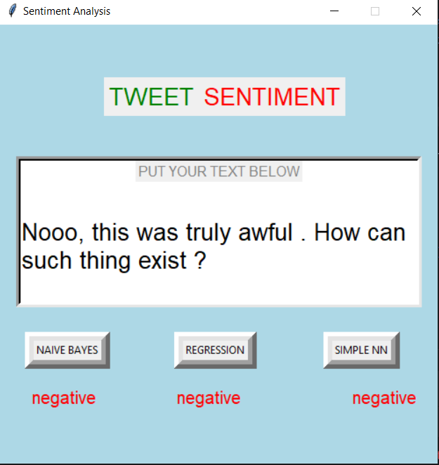
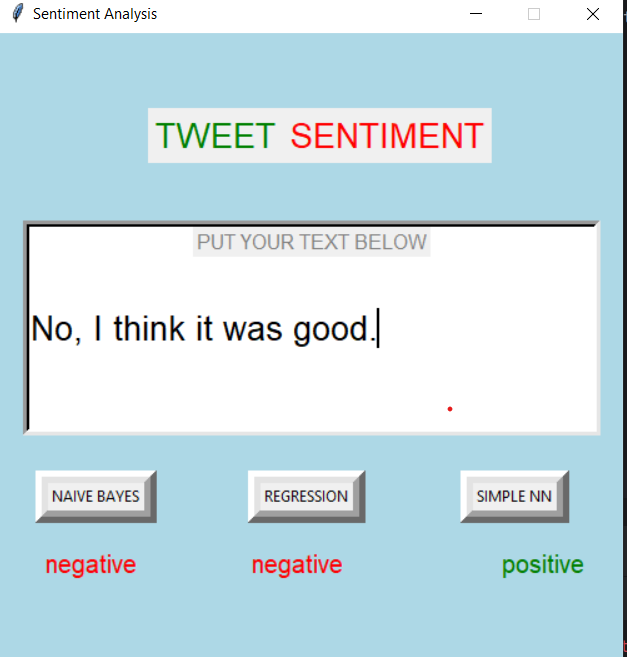

<h1 align="center"> Generative vs. Discriminative approaches for Text Classification </h1>

 <b>N.B.</b> Due to preprocessing capacity and a few other factors, my goal is to show an approach of implementing basic but also very useful baselines for sentiment analysis. Our system has to simply determine whether the sentence has positive or negative sentiment, which is not always that easy task.  

**Naive Bayes** built by exact description as in https://web.stanford.edu/~jurafsky/slp3/.
**Logistic Regression** and **Multi-Layer Perceptron** built using the standardized architecture (implemented with pytorch)

--- 
<h2>The Models</h2>

<h3> Naive Bayes </h3>
As an example of a generative model, this Naive Bayes classifier returns the class with maximum posterior probability given a
document, i.e. which is the most likely class to have generated the document.  
In this case the classes are emotions: positive and negative. The class is calculated by making use of the prior probabilities and the document likelihood, all summed in log-space to avoid underflow.
When predicting, any words that don't appear in the training set are ignored, one of the simplifying assumptions the `Naive` model makes.

<h3> Logistic Regression </h3>

The next illustrated approach is with a Logistic Regression based on a hand-designed features. From the original dataset features like positive words, negative words, exclamation marks etc. are extracted and then using the simple single-layer model classification decision is made.

<h3> Feed-Forward Network (MLP) </h3>
Lastly and with the highest score on its training data (different and bigger than on what Naive Bayes and the Regressor have been trained on) is the Feed-Forward Neural Network. The centroid of the document is taken as a training example (mean of the word embeddings in the <b>doc</b>) and then learned. This is the simplest kind of deep network with only one hidden layer. After some iterations, the architectural variant AdamW of the gradient descent optimization algorithm seems to adjust the parameters good enough for simple usage. 

Access to the dataset of the FFN can be provided upon request. All the scripts used for preprocessing can be found in the repository, as well the data for Naive Bayes model and Logistic Regression. The already processed text tensors, too. 

---

<h2>Usage</h2>

**Make sure you have installed the required packages and the word embeddings**

1. Clone the repository, open the terminal and open the folder. There type `python INTERFACE.py` and enjoy! Again, the main
   intend is the implementation, not so much the usage.

2. Small text/tweet is pasted and with just a few clicks you can see each model's inference. 

<h4>Examples</h4>

<em>Positive tweet predicted</em>

<em>Negative tweet predicted</em>

<em>Challenges</em>

It can be tried with much longer sequences , too. The Neural Network is expected to perform better on longer sequences.

--- 